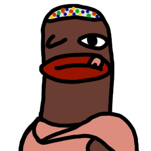

# Game Gauntlet

This is a mono-repository project of board game - AGG.
Game is a regular card game where you need to reach finish of the map
earlier than your opponents. Game is played by streamers who need to
complete random games during a broadcast to make moves on the map.

More details and previous season of game is available as [Google Document](https://docs.google.com/spreadsheets/d/e/2PACX-1vSvEtLaq5oGNNZws5vAw0DVoO3tzBMLTjwpR-MFQE2QDu91zWRCQ3NohDAaHNCnb3eaUoCq8f4HuWnj/pubhtml) (only Russian).

> [!WARNING]
> The project is under development. Currently, no self-hosted systems are available.
